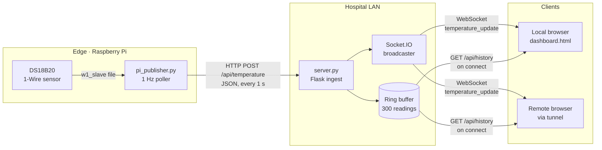
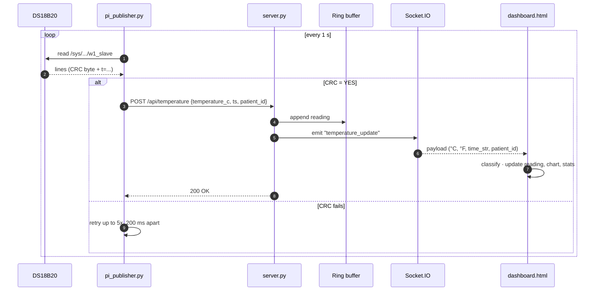
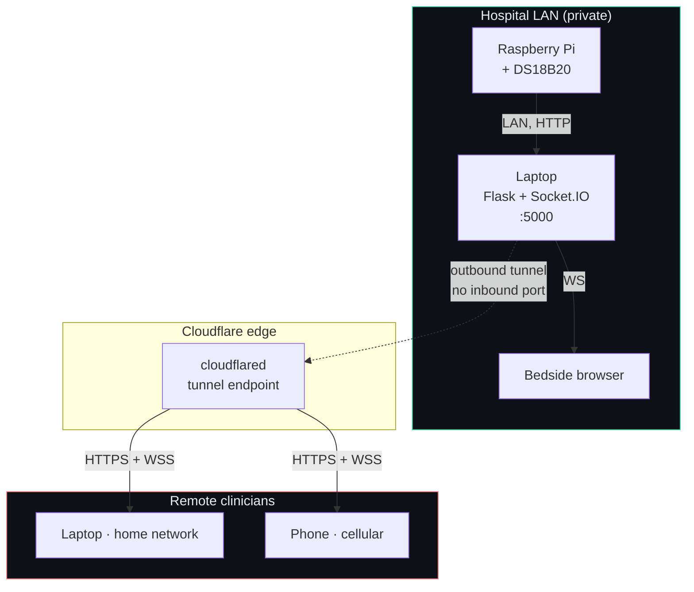

# VitalsLink

**Real-time vital-signs streaming platform - edge sensor to any browser, anywhere.**

[](https://www.python.org/)
[](https://flask.palletsprojects.com/)
[](https://python-socketio.readthedocs.io/)
[](LICENSE)

---

## What I Created

VitalsLink is an end-to-end telemetry platform for streaming patient vital signs from an edge sensor to clinicians in real time. A DS18B20 thermometer wired to a Raspberry Pi samples once per second over 1-Wire; the Pi POSTs each reading to a Flask ingest server on the same LAN; the server pushes the reading over WebSocket to every connected dashboard — locally and, via Cloudflare Tunnel, to any clinician on the public internet.

I built it as a **prototype of a production architecture** rather than a one-off script. The pieces are deliberately the same shapes a real medical-IoT stack uses: edge acquisition with CRC-validated sensor reads, an HTTP/JSON ingest boundary, a fan-out broker for live clients, a bounded server-side history buffer so late-joining clients aren't staring at an empty chart, and a clinical decision layer that classifies each reading against axillary reference ranges.

The dashboard renders a single live reading, a session min/max/mean strip, a 2-minute live trace with fever and febrile thresholds overlaid, and a status banner that flips from *Normal* to *Low-grade fever* to *Febrile* (or *Hypothermia*) as values cross the bands. It's mobile-responsive, supports °C/°F switching, and survives WebSocket-hostile networks via Socket.IO's HTTP-polling fallback.

What it is **not** yet: HIPAA-deployable. The [Roadmap](#roadmap--production-hardening) section is explicit about what would need to change before that's true — auth, TLS, persistence, audit.

---

## Features

- **1 Hz axillary thermometry** from a DS18B20 over 1-Wire, with CRC retry on bad reads (`pi_publisher.py:60-85`).
- **HTTP/JSON ingest** with strict payload validation (`server.py:60-78`).
- **Real-time WebSocket fan-out** to N concurrent browsers via Flask-SocketIO (`server.py:76`).
- **5-minute server-side ring buffer** plus `GET /api/history` backfill so new clients see context immediately (`server.py:34-35`, `server.py:81-84`, `templates/dashboard.html:768-774`).
- **Clinical classification at the UI** — Hypothermia / Normal / Low-grade fever / Febrile (`templates/dashboard.html:604-609`).
- **Mobile-responsive dashboard** with °C/°F toggle, session min/max/mean, and a live chart with fever and febrile threshold overlays.
- **Automatic reconnect and HTTP long-poll fallback** when WebSockets are blocked (Socket.IO default).
- **Public exposure** via Cloudflare Tunnel — no signup, no port-forwarding, WebSocket-clean.

---

## System Diagrams

### Architecture (component view)



### Data flow (per-reading sequence)



### Deployment topology



The dashed tunnel link marks the trust boundary: inside the ward is trusted LAN, outside the tunnel is the public internet.

---

## Tech Stack

| Layer | Technology |
|------|------|
| Edge | Raspberry Pi · DS18B20 · 1-Wire (`w1-gpio`, `w1-therm`) · Python `requests` |
| Transport | HTTP/JSON ingest · WebSocket (Socket.IO) fan-out |
| Server | Python 3.9+ · Flask 3 · Flask-SocketIO 5 · `simple-websocket` |
| Client | Vanilla JS · Chart.js 4 · Socket.IO client 4 |
| Public exposure | Cloudflare Tunnel (primary) · ngrok (alternative) |

---

## Repository Layout

| Path | Runs on | Purpose |
|------|---------|---------|
| `pi_publisher.py` | Raspberry Pi | Reads DS18B20 every second, POSTs JSON to the server. |
| `server.py` | Laptop / host | Flask + Socket.IO. Ingests readings, fans out to every connected browser, serves history backfill. |
| `templates/dashboard.html` | Served by `server.py` | The clinician dashboard — live reading, status, chart, stats. |
| `requirements.txt` | Server host | Python dependencies. |
| `LICENSE` | — | Apache 2.0. |

---

## API Reference

### `POST /api/temperature`

Ingest endpoint. Called by the edge publisher.

**Request**
```json
{
  "temperature_c": 36.78,
  "timestamp": 1747823412.123,
  "patient_id": "PT-0427",
  "sensor_id": "DS18B20-01"
}
```

Only `temperature_c` is required. `timestamp` defaults to server-time; `patient_id` and `sensor_id` default to `"PT-0427"` and `"DS18B20"`.

**Responses**
- `200 OK` — `{"status": "ok"}`
- `400 Bad Request` — `{"error": "missing temperature_c"}`

### `GET /api/history`

Returns up to the last 300 readings (≈ 5 minutes at 1 Hz). New dashboard clients call this once on load to backfill the chart.

### `GET /api/latest`

Returns the most recent reading.

### `GET /`

Serves the dashboard (`templates/dashboard.html`).

### WebSocket event · `temperature_update`

Emitted to every connected client on each ingested reading. Payload shape comes from `to_dashboard_payload()` (`server.py:39-49`):

```json
{
  "temperature_c": 36.78,
  "temperature_f": 98.20,
  "timestamp": 1747823412.123,
  "time_str": "14:30:12",
  "patient_id": "PT-0427",
  "sensor_id": "DS18B20-01"
}
```

---

## Clinical Reference Ranges (Axillary)

The UI classifies each reading via `classify()` in `templates/dashboard.html:604-609`:

| Band | Range | UI state |
|------|-------|----------|
| Hypothermia | `< 35.0 °C` | Critical (red, flashing) |
| Normal | `35.0 – 37.5 °C` | OK (green) |
| Low-grade fever | `37.5 – 38.3 °C` | Warning (amber) |
| Febrile | `> 38.3 °C` | Critical (red, flashing) |

These thresholds live in the client today; see [Roadmap](#roadmap--production-hardening) for why they should move server-side.

---

## Deployment

### 1. Edge device (Raspberry Pi) provisioning

**Wire the DS18B20** with a 4.7 kΩ pull-up resistor between DATA and 3.3 V:

| DS18B20 pin | Pi pin (BCM) | Pi physical pin |
|-------------|--------------|-----------------|
| VDD (red) | 3.3 V | pin 1 |
| DATA (yellow) | GPIO 4 | pin 7 |
| GND (black) | GND | pin 6 or 9 |
| (pull-up) | 4.7 kΩ between DATA and 3.3 V | |

**Enable 1-Wire** (one-time):
```bash
sudo raspi-config
# Interface Options -> 1-Wire -> Enable -> reboot
```
Or add `dtoverlay=w1-gpio` to `/boot/config.txt` and reboot.

**Verify** the sensor:
```bash
ls /sys/bus/w1/devices/
# expect a folder named like 28-3c01a8164d2c
```

**Install** the Python dependency and copy the publisher:
```bash
pip3 install requests
scp pi_publisher.py pi@<RASPBERRY_PI_LAN_IP>:~
```

**Configure** — set `LAPTOP_IP` in `pi_publisher.py:25`, or pass it on the command line:
```bash
python3 pi_publisher.py 192.168.1.42
```

### 2. Server deployment

```bash
python3 -m venv venv && source venv/bin/activate
pip install -r requirements.txt
python server.py
```

Expected output:
```
Dashboard:   http://localhost:5000/
Pi posts to: http://<your-laptop-LAN-IP>:5000/api/temperature
```

**Open the firewall** on port 5000 for inbound traffic from the LAN:
- macOS: System Settings → Network → Firewall → allow `python`.
- Windows: when prompted by Defender, allow on **Private** networks.
- Linux (ufw): `sudo ufw allow 5000/tcp`.

### 3. Public exposure

#### Cloudflare Tunnel (recommended)
```bash
# macOS:    brew install cloudflared
# Windows:  https://github.com/cloudflare/cloudflared/releases
# Linux:    https://pkg.cloudflare.com/

cloudflared tunnel --url http://localhost:5000
```
Prints a `https://<random-words>.trycloudflare.com` URL. Handles WebSockets cleanly out of the box.

#### ngrok (alternative)
```bash
ngrok config add-authtoken <YOUR_TOKEN>
ngrok http 5000
```

---

## Configuration

| Knob | Location | Default | Purpose |
|------|----------|---------|---------|
| `LAPTOP_IP` | `pi_publisher.py:25` | `192.168.1.179` | Server LAN address |
| `LAPTOP_PORT` | `pi_publisher.py:26` | `5000` | Server port |
| `PATIENT_ID` | `pi_publisher.py:27` | `PT-0427` | Identifier tag on each reading |
| `POLL_INTERVAL_SEC` | `pi_publisher.py:28` | `1.0` | Sampling cadence |
| `HISTORY_MAX` | `server.py:34` | `300` | Ring-buffer size (≈ 5 min at 1 Hz) |

---

## Troubleshooting

**`No DS18B20 detected at /sys/bus/w1/devices/28-*`**
1-Wire isn't enabled, or wiring is off. Re-check the pull-up resistor.

**`network error: Connection refused`**
Server isn't running, wrong `LAPTOP_IP`, or firewall is blocking. Test the network path from the Pi:
```bash
curl -X POST http://<LAPTOP_IP>:5000/api/temperature \
     -H 'Content-Type: application/json' \
     -d '{"temperature_c": 36.5}'
```
If `curl` fails, the network path is wrong — not the publisher script.

**Dashboard reads "Disconnected" even though the server is up**
The browser couldn't open a WebSocket. Always open the dashboard via `http://localhost:5000/`, not `file://`.

**Tunnel works but the chart doesn't update for remote viewers**
Some restrictive corporate networks block WebSockets. Cloudflare Tunnel handles WS well; locked-down clients fall back to HTTP long-polling, so the page still updates — just with higher latency.

**Readings look noisy / jumpy**
DS18B20 has a ±0.5 °C accuracy spec. Average 3 reads in `read_temp_c()` (`pi_publisher.py:60-85`) or apply a moving average server-side before broadcasting.

---

## Roadmap / Production Hardening

What would need to change before this could carry real patient data:

- **TLS end-to-end** — mTLS between edge and ingest; HTTPS for clients (the tunnel covers the public hop, but the LAN hop is still plaintext).
- **Authentication** on `/api/temperature` — signed device identity with rotating tokens. Today the endpoint is open.
- **Persistent store** — Postgres or TimescaleDB instead of an in-memory `deque`. Restarting the server today loses all history.
- **Append-only audit log** — every reading, every classification, every alert, with operator attribution.
- **Multi-patient, multi-sensor** — the current schema implicitly assumes one patient per server instance.
- **Server-side clinical thresholds** — move `classify()` off the client so decisions can be versioned, logged, and audited.
- **Anomaly detection** — sepsis early-warning scoring on the live stream; fever-pattern classification windowed over hours.
- **Hardened WSGI deployment** — swap `threading` async-mode + `allow_unsafe_werkzeug=True` for `eventlet`/`gevent` behind nginx or Caddy.

---

## What I Learnt

- **1-Wire is forgiving in the happy path and unforgiving in the unhappy one.** The DS18B20's first line is a CRC byte that has to read `YES` before the reading is trustworthy. Skipping the retry loop in `read_temp_c()` (`pi_publisher.py:60-85`) means occasionally publishing garbage values — which a clinical dashboard will dutifully classify as "Febrile" and alarm on.
- **I chose Socket.IO over raw WebSockets specifically because of the fallback.** The moment the dashboard leaves the LAN it crosses networks I don't control, and many corporate firewalls don't speak WebSockets. Socket.IO's HTTP long-poll fallback means the page still updates, just slower — versus a bare WS dying silently.
- **HTTP/JSON for ingest is "boring" and that's the point.** Every Pi already has a stable HTTP client, the server handler is twelve lines, and I can debug the whole transport with `curl`. The minute I reached for MQTT or gRPC I'd have lost an afternoon of yak-shaving for no benefit at this scale.
- **A small UX detail mattered more than I expected.** Without the `GET /api/history` backfill, a late-joining clinician sees a blank chart and has to wait a full minute for the trace to redraw itself. Five lines of `deque` plus a one-shot fetch fixed that completely.
- **Threading async-mode was the right tradeoff for a prototype, the wrong one for production.** `socketio.run(..., allow_unsafe_werkzeug=True)` exists for a reason — it loudly tells me this is not the path to deploy.
- **Clinical thresholds belong on the server, even when it's faster to ship them on the client.** I shipped them client-side because the UI needed them anyway; the moment this becomes a real product, the same `classify()` function has to live somewhere that can log every classification, version every threshold change, and survive a browser refresh.
- **Cloudflare Tunnel was a genuine surprise.** No signup, no inbound ports, WebSocket-clean. For a project this size it removed an entire class of "now configure your router" instructions from the deployment story.
- **The gap between "this works" and "this is HIPAA-deployable" is mostly auth, TLS, persistence, and auditability.** That's a four-item list and it's the same four items for every medical-IoT prototype I'll build after this one.

---

## License

Apache 2.0 — see [`LICENSE`](LICENSE).
